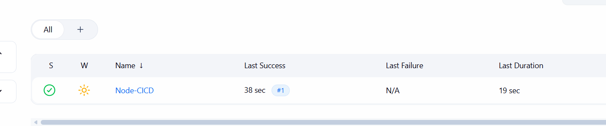
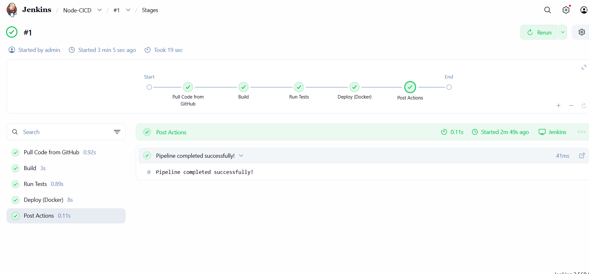
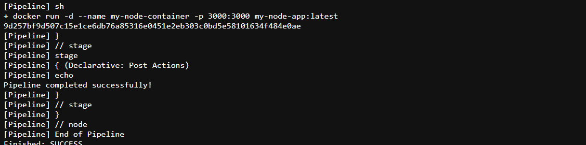
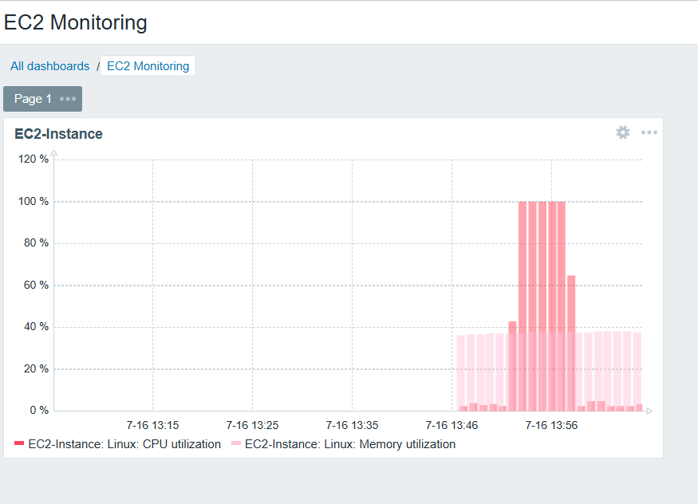
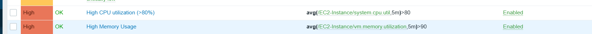

# Node.js App — Jenkins CI/CD & Zabbix Monitoring

## 📑 Table of Contents
- [📖 Overview](#-overview)
- [🏗️ Stack](#️-stack)
- [🚀 Jenkins CI/CD Pipeline](#-jenkins-cicd-pipeline)
- [📊 Zabbix Monitoring](#-zabbix-monitoring)
- [📸 Screenshots](#-screenshots)

---

## 📖 Overview

A Node.js Express application deployed on an AWS EC2 instance with a complete DevOps workflow:

- **CI/CD** — a Jenkins pipeline builds the app, runs the Mocha/Chai test suite, and deploys the Dockerized app.
- **Monitoring** — a Zabbix stack (server + PostgreSQL + web frontend + agent, via [docker-compose.yaml](docker-compose.yaml)) monitors the EC2 instance's CPU and memory, with an alert trigger that fires when CPU exceeds 80%.

---

## 🏗️ Stack

| Component | Details |
|---|---|
| App | Node.js + Express (`src/server.js`) |
| Tests | Mocha + Chai (`npm run check`) |
| CI/CD | Jenkins (EC2, port 8080) |
| Monitoring | Zabbix 6.4 (EC2, frontend on port 8088) |
| Infrastructure | AWS EC2 (Ubuntu), Docker & Docker Compose |

---

## 🚀 Jenkins CI/CD Pipeline

The pipeline runs on every push and goes through the following stages:

1. **Checkout** — pull the latest code from GitHub
2. **Install** — `npm install`
3. **Test** — `npm run check` (Mocha/Chai integration tests against `/` and `/api`)
4. **Build** — build the Docker image
5. **Deploy** — run the container on the EC2 instance

### Pipeline results

#### Pipeline overview (all stages green)

#### Stage view

#### Successful build message

---

## 📊 Zabbix Monitoring

Full setup steps are documented in [ZABBIX-SETUP.md](ZABBIX-SETUP.md). Summary:

- Zabbix server, PostgreSQL, web frontend, and agent run via Docker Compose on the EC2.
- The EC2 instance is registered as host **EC2-Instance** with the **Linux by Zabbix agent** template (the agent runs with `pid: host`, so metrics reflect the machine, not the container).
- **CPU monitoring** — item `system.cpu.util`
- **Memory monitoring** — item `vm.memory.utilization`
- **Alert trigger** — `avg(/EC2-Instance/system.cpu.util,5m)>80` (severity: High)

### Monitoring results

#### CPU & memory graphs

#### Trigger firing under load (stress test, CPU > 80%)

---

## 📸 Screenshots

All screenshots live in the [Image/](Image/) folder:

| File | Shows |
|---|---|
| `pipelinepass_overview.png` | Jenkins pipeline passing |
| `pipeline_stages_overview.png` | Jenkins stage view |
| `successful_msg.png` | Successful build output |
| `monitoring_graph.png` | Zabbix CPU/memory graphs |
| `stressed_ec2_for_trigger.png` | CPU > 80% trigger firing during stress test |

---
